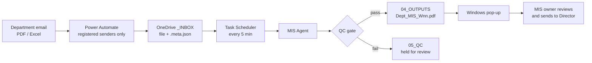

# Weekly MIS Agent

An automated pipeline that turns the weekly MIS (Management Information System) reports that departments email in, as PDF or Excel files, into a one-page A4 dashboard for the Director. It runs the moment a report arrives, with no manual prompting.

Built and deployed for a solar EPC company with 12 reporting departments. This public version contains the full engine and deployment kit. All company data, names and email addresses have been replaced with examples.


*Sample output, generated by the agent from the synthetic workbook in [`samples/input`](samples/input).*

## The problem

- 12 departments send a weekly MIS, each in its own format: PDF reports, Excel trackers and dashboards.
- They arrive at different times, by email, and someone has to read every file and rebuild a consistent one-page summary for the Director.
- Errors in the source files, such as impossible dates, totals that do not add up or two reports that disagree, were easy to miss.

## What the agent does

1. **Intake (cloud).** A Power Automate flow watches the Outlook inbox, keeps only emails from registered senders with PDF/Excel attachments, and saves each attachment to a OneDrive for Business `_INBOX` together with a small `.meta.json` file (sender and received time).
2. **Processing (Windows PC).** Task Scheduler runs the agent every 5 minutes. For each new file the agent:
   - skips duplicates (SHA-256) and waits until the file has settled for 2 minutes;
   - identifies the department from the **file content**, with the sender as a fallback;
   - works out the reporting week (Monday to Saturday) and whether the report was on time (Saturday 13:00 cut-off);
   - verifies that the department's **locked Rule Card** is unchanged (SHA-256), then extracts the data exactly as reported;
   - calculates the KPIs, lists pending work and raises data-quality issues instead of guessing;
   - renders a one-page A4 dashboard and passes it through a **QC gate** before release.
3. **Output.** `04_OUTPUTS/<year>-W<nn>/<Department>_MIS_W<nn>.pdf` plus a Windows pop-up. The MIS owner reviews it and sends it to the Director. Nothing is ever emailed automatically.



## Key design decisions

| Decision | Why |
|---|---|
| **One agent, one module per department** | Shared intake, week logic, QC and rendering; each module only knows its own source format. |
| **Locked Rule Cards** | Every department's KPIs, status mapping and checks are written down and approved before automation. The agent refuses to run if a card changes (SHA-256). |
| **Hybrid department model** | 8 departments (Type A) are processed by the agent. 5 departments (Type B) already had a working dashboard and are left untouched. |
| **Never invent data** | Missing inputs show as "Not received" or "Not reported", never zero. Contradictions become data-quality notes on the page. |
| **Human in the loop** | The agent prepares; a person reviews and sends. No code path sends email. |
| **Content before sender** | A file is routed by what it contains; the sender is only a fallback, so forwarded or re-sent files still land correctly. |

## Repository layout

| Path | Contents |
|---|---|
| `07_ENGINE/mis_agent.py` | Entry point: intake, duplicate check, routing, week detection, Rule Card lock, processing, QC gate, ledger, run log |
| `07_ENGINE/departments/` | One module per Type A department (Design, Transmission Line, Liaisoning, Procurement, PM C&I, PM Utility, O&M, Sales Utility) |
| `07_ENGINE/common/` | Shared A4 rendering (ReportLab + matplotlib), dashboard parts and the QC gate |
| `07_ENGINE/config/department_registry.example.json` | Departments, type, module, Rule Card + SHA-256, senders (examples) |
| `07_ENGINE/deploy/` | Windows install, Poppler download, inbox setup, scheduled task, launcher with pop-up |
| `07_ENGINE/tools/lock_rule_cards.py` | Locks / verifies Rule Card fingerprints |
| `01_DEPARTMENT_RULES/` | Rule Card template and the public summary of each department's locked Rule Card |
| `samples/` | Synthetic input workbook and the dashboard the agent produced from it |
| `docs/` | Architecture, deployment, Power Automate flow, operations, testing and case study |

## Quick start (local demo, any OS)

```bash
git clone https://github.com/<your-username>/weekly-mis-agent.git
cd weekly-mis-agent
python -m pip install -r requirements.txt        # plus Poppler (pdftotext) on PATH
python 07_ENGINE/tools/lock_rule_cards.py         # creates config/department_registry.json and locks the cards

mkdir -p demo/02_RAW_MIS/_INBOX
cp samples/input/Sample_Sales_Tracker.xlsx demo/02_RAW_MIS/_INBOX/
python 07_ENGINE/mis_agent.py --project-root . --work-root demo --dry-run
# dashboard: demo/04_OUTPUTS/<week>/Sales_Utility_MIS_W<nn>_DRYRUN.pdf
```

Set `MIS_ORG_NAME` to print your organisation's name on the dashboards. For the full Windows + Power Automate setup see [`docs/DEPLOYMENT.md`](docs/DEPLOYMENT.md).

## Tech stack

Python (pdfplumber, pypdf, openpyxl, ReportLab, matplotlib), Poppler `pdftotext`, Microsoft Power Automate (Outlook trigger, OneDrive for Business), OneDrive sync, Windows Task Scheduler, PowerShell notifications.

## Results

- Live since 3 October 2026. On the first day three departments' reports were turned into dashboards automatically, within minutes of the email arriving.
- Every dashboard is checked by the QC gate: one A4 page, the four sections in order, every KPI traceable to the supporting record, every material data-quality issue shown.
- Regression suite: 10 automated tests; Windows and Linux builds produced identical results on all 38 test files.

More detail: [`docs/CASE_STUDY.md`](docs/CASE_STUDY.md).

## Safety and data handling

- Source files are never edited; inbox files are moved, not changed.
- One run at a time (lock file), a 2-minute settle time, duplicates skipped by SHA-256.
- Type B departments and unidentified files are held, never processed.
- No outbound email or upload anywhere in the code.

## License

MIT, see [LICENSE](LICENSE).
